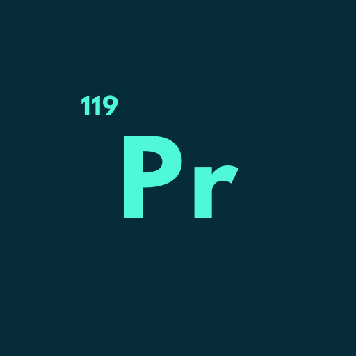

# 🧪 Elements App - Interactive Periodic Table Learning Platform

<div align="center">



**Discover the fascinating world of chemical elements with our comprehensive, interactive periodic table app!**

[](https://play.google.com/store/apps/details?id=com.furkanages.elements)

[](https://flutter.dev/)
[](https://dart.dev/)
[](https://firebase.google.com/)

</div>

---

## ✨ Features That Make Learning Fun

### 🔬 **Interactive Periodic Table**

- **Zoom & Pan**: Navigate the periodic table with intuitive gestures
- **Element Selection**: Tap any element for detailed information
- **Visual Grouping**: Elements organized by groups, periods, and blocks
- **Electronic Configuration**: Visualize electron arrangements
- **Atomic Models**: 3D representations of atomic structures

### 🎯 **Comprehensive Learning Tools**

- **Element Details**: Complete information for all 118 elements
- **Group & Period Analysis**: Understand periodic trends
- **Element Types**: Learn about metals, nonmetals, and metalloids
- **Chemical Properties**: Discover reactivity and characteristics

### 🧠 **Interactive Quizzes & Games**

- **Symbol Quiz**: Test your knowledge of element symbols
- **Group Quiz**: Identify elements by their periodic groups
- **Number Quiz**: Challenge yourself with atomic numbers
- **Achievement System**: Earn badges and track your progress
- **Statistics Tracking**: Monitor your learning journey

### 🎨 **Modern, Intuitive Design**

- **Dark Theme**: Easy on the eyes for extended learning
- **Responsive Layout**: Works perfectly on all screen sizes
- **Smooth Animations**: Engaging user experience
- **Lottie Animations**: Beautiful loading and feedback animations

### 🌍 **Multilingual Support**

- **Turkish & English**: Full localization support
- **Cultural Adaptation**: Content tailored for different regions

### 📱 **Advanced Features**

- **Home Widget**: Daily element of the day on your home screen
- **Push Notifications**: Daily chemistry tips and updates
- **Offline Support**: Learn without internet connection
- **Progress Tracking**: Monitor your learning achievements
- **Premium Features**: Ad-free experience with additional content

---

## 📱 Screenshots

### 🏠 **Home & Navigation**

<table>
  <tr>
    <td align="center">
      
      <br><b>Modern Home Interface</b>
    </td>
    <td align="center">
      
      <br><b>Interactive Periodic Table</b>
    </td>
    <td align="center">
      
      <br><b>Detailed Element Information</b>
    </td>
  </tr>  
</table>

### 🎮 **Learning & Games**

<table>
  <tr>
    <td align="center">
      
      <br><b>Interactive Quiz System</b>
    </td>
    <td align="center">
      
      <br><b>Quiz Results & Achievements</b>
    </td>
    <td align="center">
      
      <br><b>Element Groups & Categories</b>
    </td>
  </tr>
</table>

### ⚙️ **Settings & Features**

<table>
  <tr>
    <td align="center">
      
      <br><b>Settings & Preferences</b>
    </td>
    <td align="center">
      
      <br><b>Element Types & Properties</b>
    </td>
    <td align="center">
      
      <br><b>Learning Progress Tracking</b>
    </td>
  </tr>  
</table>

### 🎯 **Advanced Features**

<table>
  <tr>
    <td align="center">
      
      <br><b>Premium Features & Benefits</b>
    </td>
  </tr> 
</table>

---

## 🚀 Why Choose Elements App?

### 🎓 **Perfect for Students**

- **Comprehensive Coverage**: All 118 elements with detailed information
- **Visual Learning**: Interactive diagrams and 3D models
- **Progress Tracking**: Monitor your learning journey
- **Multiple Quiz Types**: Test knowledge in various ways

### 👨‍🏫 **Great for Educators**

- **Teaching Tool**: Perfect for chemistry classrooms
- **Visual Demonstrations**: Show periodic trends clearly
- **Student Engagement**: Gamified learning experience
- **Offline Access**: Works without internet connection

### 🔬 **For Chemistry Enthusiasts**

- **Deep Dive**: Detailed chemical and physical properties
- **Historical Context**: Discovery dates and discoverers
- **Modern Applications**: Real-world uses of elements
- **Regular Updates**: Stay current with chemistry discoveries

---

## 🛠️ Technical Excellence

### 📱 **Cross-Platform Performance**

- **Flutter Framework**: Native performance on iOS and Android
- **Responsive Design**: Optimized for all screen sizes
- **Smooth Animations**: 60fps performance guaranteed
- **Memory Efficient**: Optimized for low-end devices

### 🔧 **Modern Architecture**

- **Provider State Management**: Clean, maintainable code
- **MVVM Pattern**: Separation of concerns
- **Repository Pattern**: Clean data layer
- **Dependency Injection**: Testable and modular code

### 🔒 **Privacy & Security**

- **No Personal Data Collection**: Privacy-first approach
- **Local Storage**: Your progress stays on your device
- **Secure Communication**: HTTPS for all network requests
- **GDPR Compliant**: European privacy standards

---

## 📦 Key Technologies & Packages

### 🎨 **UI & Animation**

```yaml
lottie: ^2.6.0 # Beautiful animations
flutter_svg: ^2.0.7 # Scalable vector graphics
animated_button: ^0.2.0 # Interactive buttons
like_button: ^2.0.5 # Social interactions
neon_widgets: ^2.0.0 # Modern UI components
percent_indicator: ^4.2.3 # Progress indicators
```

### 🔄 **State Management**

```yaml
provider: ^6.0.5 # State management
equatable: ^2.0.5 # Value equality
```

### 🌐 **Network & Data**

```yaml
http: ^1.1.0 # HTTP requests
connectivity_plus: ^5.0.1 # Network connectivity
shared_preferences: ^2.2.2 # Local storage
```

### 🔥 **Firebase Integration**

```yaml
firebase_core: ^2.21.0 # Firebase core
firebase_messaging: ^14.7.10 # Push notifications
flutter_local_notifications: ^17.2.1 # Local notifications
```

### 💰 **Monetization**

```yaml
google_mobile_ads: ^6.0.0 # Ad integration
purchases_flutter: ^9.6.2 # RevenueCat integration
in_app_review: ^2.0.9 # App rating
```

### 🏠 **Home Widget**

```yaml
home_widget: ^0.6.0 # iOS/Android widgets
```

---

## 📊 App Statistics

<div align="center">

| Metric                     | Value                         |
| -------------------------- | ----------------------------- |
| 📱 **Supported Platforms** | iOS, Android                  |
| 🗣️ **Languages**           | Turkish, English              |
| 🧪 **Elements Covered**    | 118 elements                  |
| 🎯 **Quiz Types**          | 3 different modes             |
| 📊 **Learning Modes**      | Visual, Interactive, Gamified |
| 🌟 **User Rating**         | 4.5+ ⭐                       |

</div>

---

## 🎯 Target Audience

### 👨‍🎓 **Students**

- High school chemistry students
- University chemistry majors
- AP Chemistry students
- Homeschool students

### 👨‍🏫 **Educators**

- Chemistry teachers
- Science instructors
- Tutoring centers
- Online educators

### 🔬 **Professionals**

- Chemistry researchers
- Lab technicians
- Chemical engineers
- Science communicators

### 🌟 **General Public**

- Science enthusiasts
- Lifelong learners
- Parents helping children
- Anyone curious about chemistry

---

## 🚀 Getting Started

### 📱 **Download & Install**

1. Download from [Google Play Store](https://play.google.com/store/apps/details?id=com.furkanages.elements)
2. Install on your Android device
3. Open the app and start exploring!

### 🎯 **First Steps**

1. **Complete Onboarding**: Learn about app features
2. **Explore Periodic Table**: Tap elements to see details
3. **Try Quizzes**: Test your knowledge
4. **Set Language**: Choose Turkish or English
5. **Enable Notifications**: Get daily chemistry tips

### 💡 **Pro Tips**

- Use zoom gestures on the periodic table
- Check the "Element of the Day" widget
- Complete quizzes to unlock achievements
- Enable premium for ad-free experience

---

## 🔮 Future Roadmap

### 🎯 **Upcoming Features**

- [ ] **AR Integration**: Augmented reality element visualization
- [ ] **Voice Recognition**: Voice-activated element search
- [ ] **Social Features**: Share achievements with friends
- [ ] **More Languages**: Spanish, French, German support
- [ ] **Advanced Analytics**: Detailed learning insights
- [ ] **Custom Quizzes**: Create your own quiz sets

### 🧪 **Chemistry Expansions**

- [ ] **Reaction Simulator**: Visualize chemical reactions
- [ ] **Molecular Models**: 3D molecular structures
- [ ] **Lab Safety**: Laboratory safety guidelines
- [ ] **Chemistry History**: Timeline of discoveries

---

## 🤝 Contributing

We welcome contributions from the community! Here's how you can help:

### 🐛 **Report Issues**

- Found a bug? [Open an issue](https://github.com/your-repo/issues)
- Include device information and steps to reproduce
- Attach screenshots if possible

### 💡 **Feature Requests**

- Have an idea? [Submit a feature request](https://github.com/your-repo/issues)
- Describe the feature and its benefits
- Consider implementation complexity

### 🔧 **Development**

- Fork the repository
- Create a feature branch
- Make your changes
- Submit a pull request

---

## 📄 License & Privacy

### 📜 **License**

This project is licensed under the MIT License - see the [LICENSE](LICENSE) file for details.

### 🔒 **Privacy Policy**

We respect your privacy. Read our [Privacy Policy](PRIVACY_POLICY.md) to understand how we handle your data.

### 📧 **Contact**

- **Email**: support@elementsapp.com
- **Website**: [elementsapp.com](https://elementsapp.com)
- **Twitter**: [@ElementsApp](https://twitter.com/elementsapp)

---

## ⭐ Show Your Support

If you love Elements App, please consider:

- ⭐ **Star this repository**
- 📱 **Rate us on Google Play**
- 💬 **Share with friends**
- 🐛 **Report bugs**
- 💡 **Suggest features**

---

<div align="center">

**Made with ❤️ for chemistry lovers worldwide**

[](https://play.google.com/store/apps/details?id=com.furkanages.elements)

</div>
