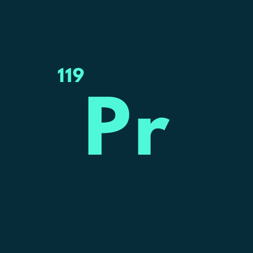

# 🧪 Elements App - Detailed Feature Documentation

**Periodic Table Application - Detailed Description of All Features**

---

## 📋 Table of Contents

1. [Main Features](#main-features)
2. [Periodic Table Features](#periodic-table-features)
3. [Element Details](#element-details)
4. [Quiz and Test System](#quiz-and-test-system)
5. [Puzzles and Games](#puzzles-and-games)
6. [Element Groups](#element-groups)
7. [Information System](#information-system)
8. [Premium Features](#premium-features)
9. [Notification System](#notification-system)
10. [Widget Features](#widget-features)
11. [Technical Features](#technical-features)

---

## 🏠 Main Features

### 🎯 Home Page (Home View)

- **Modern Design**: Gradient background and animated cards
- **Element of the Day**: A different element is featured each day
- **Quick Access**: Easy navigation to main features
- **Premium Status**: Special badge for premium users
- **Responsive Layout**: Compatible with all screen sizes

### 🌍 Multi-language Support

- **Turkish and English**: Full localization support
- **Dynamic Language Switching**: In-app language change
- **Cultural Adaptation**: Content customized for each language

---

## ⚛️ Periodic Table Features

### 🔬 Interactive Periodic Table

- **118 Elements**: All periodic table elements
- **Zoom and Pan**: Touch zoom and scroll
- **Element Selection**: Tap any element to view details
- **Color Coding**: Color categorization by element groups
- **Animations**: Smooth transition effects

### 📊 Element Groups

- **Alkali Metals**: Sodium, potassium, lithium, etc.
- **Alkaline Earth Metals**: Calcium, magnesium, etc.
- **Transition Metals**: Iron, copper, gold, etc.
- **Halogens**: Fluorine, chlorine, iodine, etc.
- **Noble Gases**: Helium, neon, argon, etc.
- **Metalloids**: Boron, silicon, germanium, etc.
- **Reactive Nonmetals**: Carbon, nitrogen, oxygen, etc.
- **Lanthanides**: Cerium, praseodymium, etc.
- **Actinides**: Uranium, plutonium, etc.

---

## 🔍 Element Details

### 📋 Detailed Element Information

Comprehensive information for each element:

#### 🧮 Basic Properties

- **Atomic Number**: Element's position in the periodic table
- **Atomic Weight**: Molar mass information
- **Symbol**: Element symbol (H, He, Li, etc.)
- **Name**: Turkish and English names
- **Period and Group**: Position in the periodic table

#### ⚡ Physical Properties

- **Electron Configuration**: Electron arrangement
- **Electronegativity**: Chemical bond formation tendency
- **Atomic Radius**: Atomic size information
- **Block**: s, p, d, f blocks

#### 🧪 Chemical Properties

- **Reactivity**: Interaction with other elements
- **Oxidation States**: Electron gain/loss tendency
- **Compound Formation**: Which compounds it forms

#### 📖 Description and Usage

- **Detailed Description**: General properties of the element
- **Usage Areas**: Industrial and daily life applications
- **Source Information**: How the element is found in nature
- **History**: Discovery information and important events

### 🎨 Visual Features

- **Color Coding**: Color by element type
- **Animations**: Smooth transition effects
- **Tab Navigation**: Different information categories
- **Add to Favorites**: Save favorite elements

---

## 🧠 Quiz and Test System

### 🎯 Quiz Types

#### 1. **Symbol Quiz**

- **Difficulty**: Easy
- **Purpose**: Learning element symbols
- **Question Format**: "What is the symbol of hydrogen element?"
- **Options**: 4 different symbol options
- **Target Audience**: Beginner level students

#### 2. **Group Quiz**

- **Difficulty**: Medium
- **Purpose**: Learning element groups
- **Question Format**: "Which group does sodium belong to?"
- **Options**: Element groups
- **Target Audience**: Intermediate level students

#### 3. **Number Quiz**

- **Difficulty**: Hard
- **Purpose**: Learning atomic numbers
- **Question Format**: "What is the atomic number of gold?"
- **Options**: Numerical options
- **Target Audience**: Advanced level students

### 🎮 Quiz Features

- **Life System**: 3 wrong answer attempts
- **Progress Tracking**: Real-time scoring
- **Time Limit**: Quick thinking skills
- **Result Analysis**: Detailed performance report
- **Achievement Badges**: Motivation system

### 📊 Statistics System

- **Total Games**: Number of quizzes played
- **Correct Answers**: Success rate
- **Best Score**: Personal record
- **Streak Tracking**: Consecutive correct answers
- **Average Time**: Speed analysis

---

## 🧩 Puzzles and Games

### 🎲 Puzzle Types

#### 1. **Word Puzzle**

- **Purpose**: Creating element names from letters
- **Difficulty Levels**: Easy, medium, hard
- **Element Selection**: First 20 or all elements
- **Scoring System**: Points per correct answer

#### 2. **Matching Game**

- **Purpose**: Matching element symbols with names
- **Game Mode**: Timed or untimed
- **Level System**: Progressive difficulty
- **Multiple Choice**: Multiple matching options

#### 3. **Element Trivia**

- **Category System**: 6 different categories
  - **Group Information**: About element groups
  - **Weight Information**: Atomic weight questions
  - **Period Information**: Periodic table position
  - **Description**: Guess by element definition
  - **Usage**: Based on usage areas
  - **Source**: Natural source information
- **Mixed Mode**: Questions from all categories

### 🏆 Achievement System

- **Badges**: Achievement badges in different categories
- **Statistics**: Detailed game statistics
- **Progress Tracking**: Daily and weekly progress
- **Leaderboard**: Best scores

### 🎯 Future Features

- **Crossword**: Traditional puzzle format
- **Periodic Table Placement**: Game of placing elements in correct positions

---

## 🏗️ Element Groups

### 📚 Group Categories

#### 1. **Metal Groups**

- **Alkali Metals**: Most reactive metals
- **Alkaline Earth Metals**: Medium reactivity
- **Transition Metals**: Catalyst properties
- **Post-transition Metals**: Weak metals

#### 2. **Non-metal Groups**

- **Halogens**: Salt forming
- **Noble Gases**: Non-reactive
- **Reactive Nonmetals**: Form various compounds

#### 3. **Metalloid Groups**

- **Semiconductor Properties**: Electronic applications
- **Amphoteric Character**: Acid and base properties

### 🔍 Group Details

- **Physical Properties**: Appearance, density, melting point
- **Chemical Behavior**: Reactivity, bond formation
- **Usage Areas**: Industrial applications
- **Historical Information**: Discovery and usage history

---

## 📖 Information System

### 🎓 Educational Content

#### 1. **General Information**

- **Periodic Table History**: From Dmitri Mendeleev to present
- **Element Discoveries**: Important discoveries and scientists
- **Chemistry Basics**: Atomic structure and bond types

#### 2. **Element Types**

- **Metal Properties**: Conductivity, luster, malleability
- **Non-metal Properties**: Insulation, brittleness
- **Metalloid Properties**: Hybrid character

#### 3. **Chemical Bonds**

- **Ionic Bonds**: Metal-nonmetal interaction
- **Covalent Bonds**: Nonmetal-nonmetal sharing
- **Metallic Bonds**: Metal-metal interaction

### 📱 Modern Information Interface

- **Categorized Content**: Easy navigation
- **Visual Enhancement**: Images and diagrams
- **Interactive Elements**: Clickable components
- **Search Function**: Quick information finding

---

## ⭐ Premium Features

### 💎 Premium Subscription

- **Ad-free Experience**: Usage without any ads
- **Unlimited Quizzes**: Unlimited gameplay in all quiz types
- **Premium Puzzles**: Special difficulty levels
- **Advanced Statistics**: Detailed performance analysis
- **Exclusive Themes**: Special visual themes for premium users

### 🎁 Premium Benefits

- **More Lives in Games**: More error tolerance
- **Advantages in All Games**: Bonuses in every game type
- **Priority Support**: Fast customer service
- **Beta Features**: First access to new features

### 💳 Purchase System

- **RevenueCat Integration**: Secure payment system
- **Subscription Management**: Easy cancellation and renewal
- **Purchase Restoration**: Easy device changes
- **Multi-platform**: iOS and Android compatibility

---

## 🔔 Notification System

### 📱 Push Notifications

- **Firebase Integration**: Reliable notification service
- **Daily Element**: Information about different element each day
- **Quiz Reminders**: Regular learning reminders
- **Achievement Notifications**: Badge earning and score updates

### ⚙️ Notification Settings

- **Permission Management**: User control
- **Notification Types**: Selective notification settings
- **Time Settings**: Notification schedules
- **Silent Mode**: Temporary notification pause

### 🔧 Technical Features

- **Background Handler**: Notifications when app is closed
- **Local Notifications**: Local notification support
- **Permission Service**: Smart permission management
- **FCM Token Service**: Secure token management

---

## 📱 Widget Features

### 🏠 Home Screen Widget

- **Element of the Day Widget**: Daily element information
- **iOS and Android Support**: Works on both platforms
- **Automatic Updates**: Daily element changes
- **Clickable**: Tap widget to open app

### 🔄 Widget Management

- **App Group Integration**: Group configuration for iOS
- **Scheduled Updates**: Automatic update system
- **Error Management**: Reliable widget operation
- **Performance Optimization**: Low resource usage

---

## 🛠️ Technical Features

### 📱 Platform Support

- **Flutter Framework**: Cross-platform development
- **iOS 12.0+**: iPhone and iPad support
- **Android 5.0+**: Wide Android device support
- **Responsive Design**: All screen sizes

### 🗄️ Data Management

- **Provider State Management**: Modern state management
- **SharedPreferences**: Local data storage
- **JSON Serialization**: Data conversion
- **Offline Support**: Usage without internet

### 🎨 UI/UX Features

- **Material Design**: Modern design language
- **Custom Animations**: Custom animations
- **Lottie Animations**: Vector animations
- **Gradient Backgrounds**: Multi-colored backgrounds
- **Dark Theme**: Eye-friendly dark theme

### 🔧 Developer Tools

- **Device Preview**: Testing on different devices
- **Very Good Analysis**: Code quality control
- **Build Runner**: Code generation
- **Flutter Launcher Icons**: Automatic icon generation

### 📊 Analytics and Ads

- **Google Mobile Ads**: Ad integration
- **AdMob Provider**: Ad management
- **Banner Ads**: Bottom ad areas
- **Rewarded Ads**: Rewarded advertisements
- **Interstitial Ads**: Full-screen ads

### 🔒 Security and Privacy

- **Firebase Security**: Secure backend services
- **Data Encryption**: Data encryption
- **Privacy Policy**: Privacy policy
- **GDPR Compliance**: Data protection compliance

### 🚀 Performance Optimization

- **Lazy Loading**: Fast page loading
- **Image Optimization**: Optimized images
- **Memory Management**: Memory management
- **Battery Optimization**: Battery optimization

---

## 📈 Future Features

### 🎮 Gamification

- **Multiplayer Mode**: Competition with friends
- **Weekly Tournaments**: Competitive games
- **Social Sharing**: Share achievements
- **Global Leaderboard**: Worldwide scores

### 🎓 Educational Improvements

- **AR Element Viewing**: Augmented reality
- **3D Atom Models**: Interactive atom visualization
- **Video Lessons**: Short educational videos
- **Personalized Learning**: AI-supported learning path

### 📊 Advanced Analytics

- **Learning Progress**: Detailed progress tracking
- **Weak Point Analysis**: Missing knowledge areas
- **Recommended Content**: Personalized recommendations
- **Goal Setting**: Learning objectives

---

## 🤝 Contributing

This application is continuously being developed. Your suggestions and feedback are valuable to us.

### 📧 Contact

- **Email**: [Email address]
- **GitHub**: [GitHub repository]
- **App Store**: [App Store link]
- **Google Play**: [Google Play link]

---

## 📄 License

This project is licensed under [license type]. See the [LICENSE](LICENSE) file for details.

---

**Discover chemistry with Elements App! 🧪⚛️**

_Last updated: 2024_

